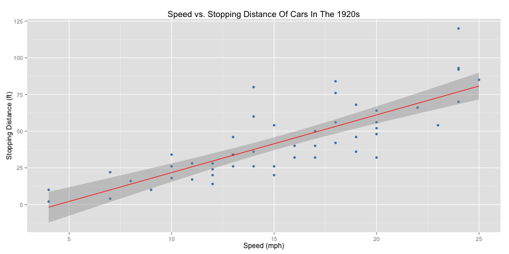

## Introducing The ESD Shiny App! 

### Scenario:

You need a new car and have a great opportunity to purchase 
a "slightly used" 1920 Model T Ford. However, you also live
in Los Angeles, California where stop-and-go traffic is the
norm, and you are concerned that the stopping distance of
this car (with a top speed of 25 mph) will be too long for
the mean streets of LA.

### Solution:  

The ESD (Estimated Stopping Distance) Shiny App is here 
to help! You simply select the top speed you expect to 
reach while driving the freeways of LA (somewhere between 
5 mph and 25 mph), and the shiny app will instanteously 
calculate and report the estimated stopping distance 
based on the linear model fitted to the data in the 
cars dataset. Yes, it's that easy.

--- .class #id 

## The Model Beneath The ESD Shiny App

The following figure shows the cars dataset 
(from the R datasets package) fitted with a 
simple linear regression model.  

 

--- 

## ESD Shiny App Model Details

The linear equation for the regression line is: 
distance = -17.58 + 3.93 * speed. 
The linear equation appears to be a reasonably good 
fit with a correlation coefficient (r) of 0.8069. 
Additionally, the model accounts for  ~65.11% 
of the variation in the stopping distances.  

The residuals plot below shows one possible point of concern.
It appears as though the data may be fanning out from left to
right. Ideally it would be good to have more than 50 
observations in the dataset to be able to confirm whether or not 
this is a legitimate concern.

 

--- 
    
## Further Reading & Thoughts

### Source:

Ezekiel, M. (1930) *Methods of Correlation Analysis*. Wiley.

### References:

McNeil, D. R. (1977) *Interactive Data Analysis*. Wiley.

### Next Steps:

The linear model accounts for ~65% 
of the variation in the stopping distances. Other models 
(e.g., polynomial) might do even better at accounting 
for more of the variation. Also, the possible non-random 
scatter of the residuals about the x-axis in the residuals 
plot suggests that a simple linear model may not be the 
most appropriate for this data.
